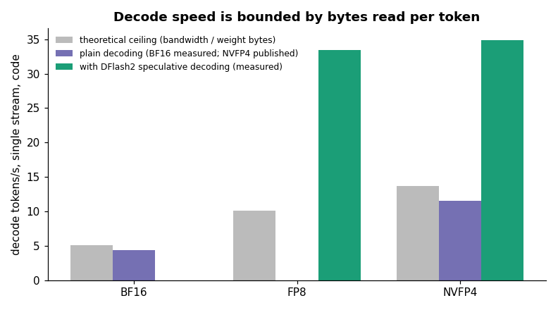
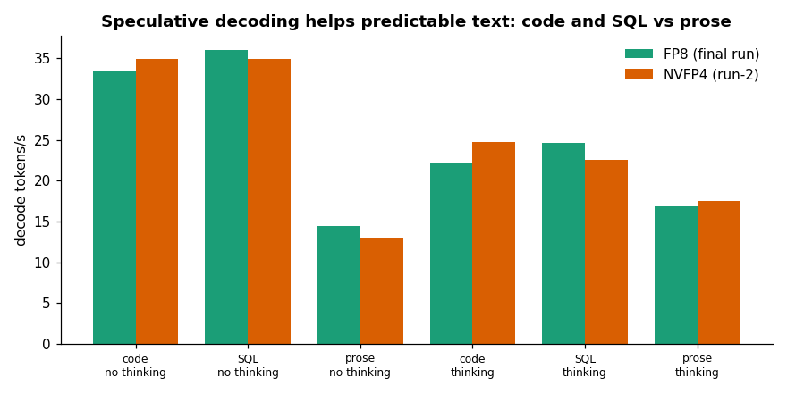
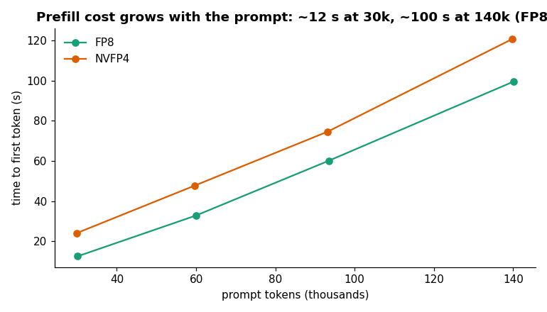
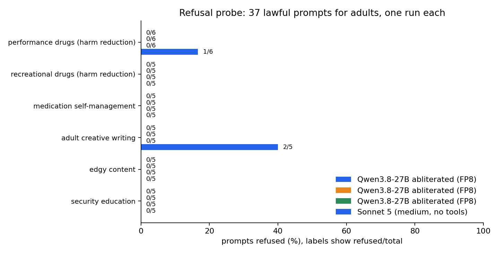

# Qwen abliterated API — self-hosted, OpenAI-compatible, reproducible

An OpenAI-compatible endpoint (chat, thinking, tool calling, vision, speech-to-text) for an abliterated **Qwen3.8-27B** running on a rented **NVIDIA GB10**, published at a stable HTTPS URL on your own domain, and rebuildable on any other machine by changing only its address.

This repository is the whole system: the serving configuration, the edge routing, the infrastructure as code, the test and benchmark suite, and the raw data behind every number. It started as "why is my 27B model at 4 tokens/s on a very good GPU?" and ended as a documented case study in LLM serving; the write-up material is in [`docs/article/`](docs/article/).

- [Results at a glance](#results-at-a-glance)
- [Architecture](#architecture)
- [Use the API](#use-the-api)
- [Bring it up](#bring-it-up) (step-by-step: [`docs/SELF_HOSTING.md`](docs/SELF_HOSTING.md))
- [CI and CD](#ci-and-cd)
- [How it works](#how-it-works)
- [Operate it](#operate-it)
- [Tests and benchmarks](#tests-and-benchmarks)
- [Repository map](#repository-map)
- [Limits and what is not claimed](#limits-and-what-is-not-claimed)
- [Security notes](#security-notes)

## Results at a glance

Default profile: **FP8** weights (BF16 checkpoint quantised at load) + DFlash2 speculative decoder, bf16 KV cache, 160 000-token context. All numbers were measured through the public HTTPS endpoint; raw data in [`reports/`](reports/README.md), tables in [`docs/RESULTS.md`](docs/RESULTS.md).

| what | result |
|---|---|
| decode, code / SQL, thinking off | 33 / 36 tok/s (free prose ~14) |
| decode, thinking on | 17 – 25 tok/s |
| time to first token, short prompt | 1.4 – 1.8 s |
| aggregate throughput, 4 / 8 clients | 91 / 99 tok/s |
| long context | needle retrieved in 8/8 attempts up to ~140k tokens (prefill ~12 s at 30k, ~100 s at 140k; a repeated prompt is served from the prefix cache) |
| quality: HumanEval / GSM8K | **96.3 % / 96.0 %** (Sonnet 5 medium on the same grader: 100 % / 98.5 %) |
| vision | `image_url` works |
| audio | Whisper sidecar on the same GPU, `/v1/audio/transcriptions` (the chat model has no audio input; it is rejected with a clean 400) |
| parallel questions | 16 different questions at once, 16/16 correct |
| idempotency | 16/16 checks, including a real provider stop/start |
| refusal probe (37 lawful adult prompts) | Qwen 0 refused, Sonnet 5 3 refused ([`docs/REFUSAL.md`](docs/REFUSAL.md)) |
| cost | ~US$ 0.34 per 1000 benchmark tasks with a busy GPU vs ~US$ 8 per 1000 with Sonnet 5 (API-equivalent); the GPU is cheaper above ~4 % utilisation |

Two findings worth knowing before you copy this setup:

1. **FP8 is as fast as NVFP4 once speculative decoding is on**, contrary to the bandwidth arithmetic for plain decoding (details in [`docs/ARCHITECTURE.md`](docs/ARCHITECTURE.md)). The two precisions are statistically indistinguishable in quality; FP8 wins on prefill and throughput, so it is the default. `PROFILE=nvfp4` selects the other one.
2. **An fp8 KV cache silently corrupted long generations**: in a saved experiment the needle test passed at prompts up to ~21k tokens and failed in all 6 attempts at ~24.5k tokens and above (6/12 overall), always with the same degenerate output, while every short benchmark passed; with the bf16 KV cache the same series was 12/12. The default is the bf16 KV cache, and `tests/longctx.py` is the test that catches it (data: `reports/longctx/longctx-fp8kv-experiment.json`).

### Figures



*Decode speed against the bandwidth ceiling. Plain decoding sits at the ceiling of its number format; speculative decoding goes past it on predictable text.*



*Decode speed by workload (code, SQL, prose), thinking on and off.*



*Time to first token against prompt length, FP8 and NVFP4.*


*HumanEval pass@1 with 95 percent intervals against cost per 1,000 tasks.*


*The fp8 KV cache failed from about 24,500 prompt tokens; the bf16 KV cache did not.*



*Refusal probe: 37 lawful prompts for adults, one run each. Full table and caveats in `docs/REFUSAL.md`.*

## CI and CD

CI runs here (`validate.yml`: Terraform validate and fmt, Compose config, shell syntax, Python compile). CD runs from a separate infra repository that holds the secrets and checks this repository out. Diagram and how to recreate it: [`docs/CICD.md`](docs/CICD.md).

## Architecture

```text
client (OpenAI SDK / curl)
   │  https://qwen.example.com/v1        Authorization: Bearer <VLLM_API_KEY>
   ▼
Traefik on the edge VPS       TLS: Let's Encrypt · DNS: Hostinger A record · streaming flushInterval 1 ms
   │  /v1/*        injects the provider's edge auth cookie (clients never see it)
   │  /v1/audio/*  routed straight to the Whisper sidecar
   ▼
Vast.ai container (GB10, 119 GB unified memory, no Docker-in-Docker, Supervisor-managed)
   ├─ Caddy edge :8000 ─► vLLM :18000   Qwen3.8-27B abliterated (FP8) + DFlash2 drafter, bearer key enforced
   └─ Whisper sidecar :3000             vLLM serving openai/whisper-large-v3-turbo (10 % of GPU memory), same key
```

Why an edge VPS at all: a DNS A record cannot carry a port, and the GPU provider maps container ports to random high numbers that change when an instance is recreated. The DNS name points at a stable VPS that already runs Traefik; the route to the GPU is three managed blocks (five with Whisper) in its config, rewritten idempotently.

## Use the API

```bash
export OPENAI_BASE_URL=https://qwen.example.com/v1
export OPENAI_API_KEY=...        # the VLLM_API_KEY secret

curl "$OPENAI_BASE_URL/chat/completions" -H "Authorization: Bearer $OPENAI_API_KEY" -H 'Content-Type: application/json' \
  -d '{"model":"qwen-abliterated","messages":[{"role":"user","content":"Write a retry decorator."}],
       "chat_template_kwargs":{"enable_thinking":false}}'
```

```python
from openai import OpenAI
c = OpenAI(base_url="https://qwen.example.com/v1", api_key="...")
r = c.chat.completions.create(model="qwen-abliterated", temperature=0, max_tokens=2048,
      messages=[{"role": "user", "content": "Write a robust Python retry helper."}],
      extra_body={"chat_template_kwargs": {"enable_thinking": True}})   # reasoning arrives in message.reasoning
```

- **Thinking** is on by default when the client says nothing; `chat_template_kwargs.enable_thinking=false` turns it off (about 2× faster for short answers). The chain of thought is returned separately in `reasoning`, the answer in `content`.
- **Tool calling**: `tool_choice: "auto"` works (`qwen3_xml` parser).
- **Images**: `{"type":"image_url","image_url":{"url":"data:image/png;base64,..."}}` inside the message content.
- **Audio**: transcribe first, then chat —
  `curl $OPENAI_BASE_URL/audio/transcriptions -H "Authorization: Bearer $OPENAI_API_KEY" -F model=whisper -F language=pt -F file=@question.wav`
- **Embeddings**: `POST /v1/embeddings` with model `qwen-embedding` (Qwen3-Embedding-4B, a third vLLM on the same GPU with the pooling runner, `EMBED=0` disables it). The model is Matryoshka, so `"dimensions": 768` gives 768-dimension vectors. Put the instruction on the query side only (`Instruct: <task>
Query:<text>`) and send documents without a prefix. Measured through the public endpoint from a server: about 22 texts per second (about 1,400 tokens per second) with batches of 64 and 8 concurrent requests; 16 concurrent requests was slower. It shares the GPU with the chat model, so a heavy embedding job slows chat responses (`tests/embed_bench.py` measures quality and speed).
- **Context**: 160 000 tokens configured. Long prompts cost prefill time; reuse the same prefix to benefit from the cache.
- The model card recommends `temperature=0`.

## Bring it up

You need: a rented GPU container that ships `sshd` (a Blackwell GB10 is what this was tuned on), an edge host running Traefik with a file-provider config, DNS API access, and a stable client key. Secrets used by the automation: `DEPLOY_SSH_PRIVATE_KEY`, `VLLM_API_KEY`, `HOSTINGER_API_KEY`, `EDGE_SSH_PRIVATE_KEY`, `VAST_API_KEY`, `VAST_INSTANCE_ID`.

Register the deploy key on the **account** at the provider (not only on the instance: Vast rewrites `authorized_keys` from account keys), then choose one path. All three run the same idempotent scripts.

### A. Terraform (recommended)

```bash
cd infra/terraform-vast
cp terraform.tfvars.example terraform.tfvars     # instance address, mapped ports, keys (git-ignored)
terraform init -backend=false
terraform apply                                  # configure → route → DNS → acceptance test
terraform plan -detailed-exitcode                # exit 0: nothing to change
```

No provider is downloaded (`terraform_data` + `local-exec`); each step re-runs only when its inputs change. A new machine means changing `vast_ssh_host`, `vast_ssh_port`, `vast_api_port`, `vast_whisper_port`, `vast_instance_id` and applying again.

### B. GitHub Actions (in the infra repository)

Deployment workflows hold secrets, so they live in a separate infra repository and check this one out at run time ([`docs/CICD.md`](docs/CICD.md)). Run **Deploy Qwen API to Vast instance** there with `ssh_host`, `ssh_port`, `api_port`, `whisper_port`, `instance_id` (and `profile`, default `fp8`). It downloads weights if missing, writes the config, publishes the route, upserts DNS, waits for `/v1/models` and smoke-tests a completion.

### C. By hand

```bash
# on the instance (SSH port from VAST_TCP_PORT_22)
scp scripts/configure-vast-vllm.sh root@HOST:/root/configure.sh
ssh root@HOST "PRUNE_UNUSED=1 VLLM_API_KEY=... bash /root/configure.sh"

# from your machine
EDGE_SSH=root@EDGE EDGE_KEY=... PUBLIC_HOST=qwen.example.com VAST_IP=... VAST_PORT=<mapped 8000> \
  VAST_LABEL=C.<id> VAST_TOKEN=<OPEN_BUTTON_TOKEN> WHISPER_PORT=<mapped 3000> scripts/publish-endpoint.sh
HOSTINGER_API_KEY=... scripts/dns-upsert.sh example.com qwen <edge-ip>
scripts/smoke-test.sh https://qwen.example.com "$VLLM_API_KEY"
```

The first deployment downloads ~56 GB (BF16 52 GB, drafter 3.6 GB) plus 1.6 GB for Whisper, about 10 minutes; later runs move no bytes. A full restart takes ~7 minutes (52 GB read from disk plus FP8 quantisation).

Profiles and knobs (environment variables of `configure-vast-vllm.sh`): `PROFILE=fp8|nvfp4`, `MAX_LEN` (160000), `GPU_UTIL` (0.60, leaves room for other GPU workloads), `KV_DTYPE` (`auto`), `NSPEC` (7), `WHISPER=0|1`, `PRUNE_UNUSED=1` (delete the other profile's weights from the billed disk).

A second deployment path for a genuine Ubuntu GPU VM (Docker + Caddy) lives in [`compose.yaml`](compose.yaml), [`infra/terraform`](infra/terraform) and the `deploy-qwen-terraform.yml` workflow in the infra repository.

## How it works

Short version; the reasoning, numbers and pitfalls are in [`docs/ARCHITECTURE.md`](docs/ARCHITECTURE.md).

- **Decoding is memory-bound.** One token requires reading every weight of a dense model once, so single-stream speed ≈ memory bandwidth ÷ weight bytes. On a ~273 GB/s GPU, a 54 GB BF16 model tops out near 5 tok/s (measured: 4.4). Smaller weights buy speed linearly.
- **Speculative decoding multiplies it.** A 3.6 GB drafter (DFlash2) proposes 7 tokens per step and the 27B model verifies them in a single weight read. Acceptance depends on how predictable the text is: code and SQL accept long runs, free prose does not, hence 33–36 vs 14 tok/s.
- **Quantisation choice.** FP8 (BF16 checkpoint quantised by vLLM at load) is the default; NVFP4 is the alternative. Same abliterated weights, statistically the same quality.
- **KV cache in bf16**, because fp8 corrupts long contexts (see Results).
- **Auth in two layers, one key.** The provider's Caddy edge wants an instance token that changes on every instance. Traefik injects it as a cookie; `Authorization: Bearer` stays free for vLLM's own `--api-key`. Clients only ever hold the stable key.
- **Whisper sidecar** starts after the LLM is healthy (two vLLM processes profiling GPU memory at the same moment miscount each other), takes 10 % of GPU memory and is routed by path on the same domain.
- **Persistence.** Weights live on the instance disk and survive stop/start; nothing is downloaded on restart. Destroying the instance deletes them, so it is never used as "off".

## Operate it

```bash
scripts/vast-power.sh status | start | stop      # needs VAST_API_KEY, VAST_INSTANCE_ID
```

A stopped instance costs ~US$ 0.007/h (disk only) instead of ~US$ 0.45/h. After a start the API returns by itself in ~8 minutes with the same address, and the Whisper sidecar in under a minute after that. If the provider hands back a different address, re-run `scripts/publish-endpoint.sh`. Health checks, logs, the list of known failure modes and the Terraform workflow are in [`docs/RUNBOOK.md`](docs/RUNBOOK.md).

## Tests and benchmarks

Everything is scripted, stdlib-only Python, and writes raw JSON under [`reports/`](reports/README.md). `docs/RESULTS.md` is generated from those files.

| script | what it proves |
|---|---|
| [`tests/suite.py`](tests/suite.py) | auth (401 / 401 / 200), models, speed with thinking on/off, heavy-context needle tests, thinking parser contract, 10 executed coding tasks, tool calling, concurrency 1–8, long generation, prefix cache, default thinking, stability (60 requests), vision, audio rejection, speech-to-text, 16 parallel questions |
| [`tests/quality.py`](tests/quality.py) | HumanEval (164, code executed locally with timeouts) and GSM8K (200), plus fixed-prompt outputs for fidelity comparison |
| [`tests/quality_claude.py`](tests/quality_claude.py) | the same prompts and grader run through Claude Code (`claude -p`, Sonnet 5 medium, tools off) as a yardstick |
| [`tests/longctx.py`](tests/longctx.py) | needle in a haystack from 16k to 150k tokens, several seeds |
| [`tests/refusal.py`](tests/refusal.py), [`make_refusal_report.py`](tests/make_refusal_report.py) | refusal probe over lawful adult prompts for any OpenAI-compatible endpoint or Claude Code; stores verdicts and refusal openings only |
| [`tests/pipeline_audio.py`](tests/pipeline_audio.py) | speech → Whisper → Qwen round trip through the public API |
| [`tests/idempotency.py`](tests/idempotency.py), [`restart_cycles.py`](tests/restart_cycles.py) | re-running changes nothing, config drift is repaired, forced kills recover without downloads, a real provider stop/start comes back on the same address |
| [`tests/queue_variants.py`](tests/queue_variants.py), [`queue_quality.py`](tests/queue_quality.py) | unattended experiment queues (deploy a variant, run the same benchmarks) |
| [`tests/make_report.py`](tests/make_report.py), [`make_results.py`](tests/make_results.py) | JSON → Markdown, including paired significance tests (McNemar) and cost per task |
| [`tests/run_all.py`](tests/run_all.py) | one entry point: suite, audio pipeline, idempotency, reports |

```bash
export BASE_URL=https://qwen.example.com/v1 API_KEY=...
python tests/suite.py --out reports/runs/run.json           # ~25 min, no server access needed
python tests/quality.py fp8                                  # HumanEval + GSM8K (~17 min)
python tests/run_all.py --tag mytag                          # also needs the SSH/provider variables (see its docstring)
python tests/make_results.py > docs/RESULTS.md
```

Method notes that matter when reading the numbers:

- **The grader was audited.** My first grader had two real bugs (helper functions defined in the prompt were not prepended, causing 4 `NameError`s; a 1024-token cap cut 6 GSM8K answers before the final line) and one design flaw (the thinking test tied the parser contract to answer accuracy). They were fixed and validated in both directions (a correct solution passes, a wrong one fails). Re-running with the fixed grader moved the NVFP4 totals by only -1 (HumanEval) and +3 (GSM8K), because run-to-run variation at temperature 0 (batching and speculative decoding are not bit-deterministic) is of the same order, a few problems per 164. That is why differences are tested for significance instead of read off the totals. The first-grader file is kept as `quality-nvfp4-harness-v1.json` and flagged.
- **Differences are tested, not eyeballed.** With 164 problems a 2-point gap is noise. Paired McNemar tests: Sonnet 5 beats both Qwen precisions on HumanEval (p = 0.03 and 0.002), the three are indistinguishable on GSM8K, and FP8 vs NVFP4 is not significant on either.
- **Speed cells are single runs**; a few tok/s of difference is within noise, and NVFP4 and FP8 were measured at different configured context lengths (32k vs 160k).

## Repository map

| path | what |
|---|---|
| `scripts/` | `configure-vast-vllm.sh` (weights, vLLM, Whisper, idempotent), `publish-endpoint.sh` (Traefik route), `dns-upsert.sh`, `vast-power.sh`, `smoke-test.sh`, `benchmark.sh`, VM bootstrap for the Docker path |
| `infra/terraform-vast/` | Terraform for the container profile (configure, route, DNS, acceptance) |
| `infra/terraform/`, `compose.yaml`, `Caddyfile` | the genuine-VM path (Docker + Caddy) |
| `.github/workflows/` | `validate.yml` (CI: Terraform, Compose, shell syntax, Python compile). Deploy workflows live in the infra repository, see [`docs/CICD.md`](docs/CICD.md) |
| `tests/` | the suite, quality, idempotency and queue scripts above; `tests/fixtures/speech-pt.wav` |
| `reports/` | raw data by kind: `runs/`, `quality/`, `longctx/`, `ops/` |
| `docs/` | [`ARCHITECTURE.md`](docs/ARCHITECTURE.md), [`RUNBOOK.md`](docs/RUNBOOK.md), [`RESULTS.md`](docs/RESULTS.md), [`article/`](docs/article/) (dossier for the write-up) |
| `SPEC_OPERACIONAL.md` | the operating contract this repo implements (Portuguese) |

## Limits and what is not claimed

- **Refusal behaviour is measured only narrowly.** A probe of 37 lawful prompts for adults (harm-reduction dosing, self-managed medication, adult creative writing, edgy humor, security education) got 0 refusals from this model and 3 from Sonnet 5 on the same prompts; details and caveats in [`docs/REFUSAL.md`](docs/REFUSAL.md). One run per prompt, one prompt set, a regex classifier, no GPT measured. The abliteration itself is the publisher's work (same weights in both precisions, per the model cards).
- **Not a frontier model.** A dense 27B at FP8 is 4 points below Sonnet 5 on HumanEval in this test and is not equivalent for long agentic work. The yardstick is a plain completion without tools on two tasks, not a general ranking.
- **Prose is slow** (~14 tok/s) because the drafter accepts fewer tokens on unpredictable text.
- **Long prompts cost minutes of prefill** (~100 s at 140k tokens on first use).
- **A GPU shared with a real-time workload loses throughput**: both share the same memory bandwidth. `GPU_UTIL` reserves memory, not bandwidth. This was not measured with a real second workload.
- **Cost figures** assume a busy GPU; an idle rented GPU costs the same per hour. Claude's cost is the API-equivalent figure reported by Claude Code.
- The provider's stop/start is not guaranteed to return the same GPU; everything here can be rebuilt on a new instance from the scripts.

## Security notes

- No secret is committed: keys live in GitHub secrets and a private vault; `*.tfvars`, `*.tfstate` and `.env` are git-ignored, and a scan of the tracked files and recent history found none of the keys in use.
- Clients hold one stable key; the provider's edge token never leaves the edge host.
- Deploy secrets (SSH keys, DNS token, API key) live in the infra repository, never here. The edge SSH key is a broad credential (root on a shared VPS), so use a scoped deploy user where you can.
- Addresses and hostnames in this repository are placeholders (`example.com`, `EDGE_IP`, `203.0.113.x`).
- Model licences and the publishers' cards apply; the abliterated checkpoints are research previews by their authors.
